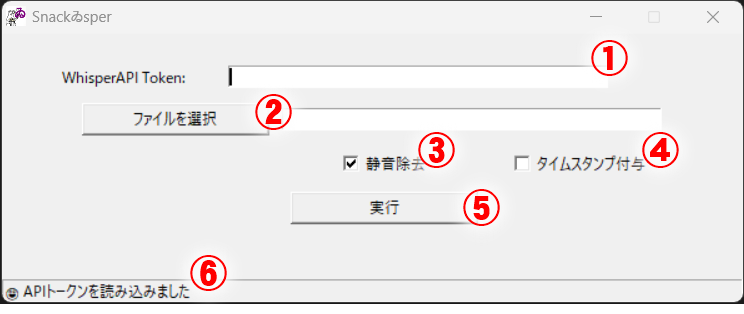

# 使い方

## 読み方
Snackゐsperは「すなっくうぃすぱぁ」と読みます。

## 概要
SnackWhisperはWhisper APIを利用した音声書き起こしを実行します。
`main.py`を実行して、音声ファイルをテキストに変換するウィンドウを呼び出してください。

    $ python main.py

## ダウンロード
pyinstallerを使ってexe化した[Windows用バイナリ](https://github.com/monosus/snackwhisper/tree/main/dist)も用意しています。

β版につき、自己責任でご利用ください。

## 実行環境
Windowsコマンドライン(cmd.exe)またはMacOSのシェルから実行可能です。

## 依存関係
SnackWhisperはFFmpegを利用します。お使いの環境にインストールしたうえで実行してください。

> - FFmpeg
>     - https://ffmpeg.org/

## 実行方法

    $ python main.py

`main.py`を実行するとウィンドウが表示されます。

## 機能説明
### ① OpenAI API Token

OpenAIのAPI Tokenを入力してください。Whisper APIによる文字起こしに利用します。
また、ここに入力したトークン文字列は終了時に`config.ini`ファイルに保存されます。

### ② ファイル選択ボタンおよびパス表示エリア

文字起こしをしたい動画ファイル/音声ファイルを指定します。
動画ファイルを指定した場合は、FFmpegにより音声部分を切り離したうえで文字起こしを行います。
また、一つの音声ファイルが25MBを超えた場合も自動的に分割して文字起こしを行います。

### ③ 静音除去オプション

Whisper APIに投げる前に音声ファイルの静音部分の除去を行います。
これにより、API利用料金の省コスト化が見込めます。

### ④ タイムスタンプ付与オプション

出力する書き起こしにタイムスタンプを付与します。
静音除去と併用すると時間がずれることをご了承ください。

### ⑤ 実行ボタン

ここまでの設定で書き起こしを実行します。

### ⑥ ステータス表示エリア

処理の進行状況を表示します。
エラーが出た場合はここの表示を参考にしてください。

